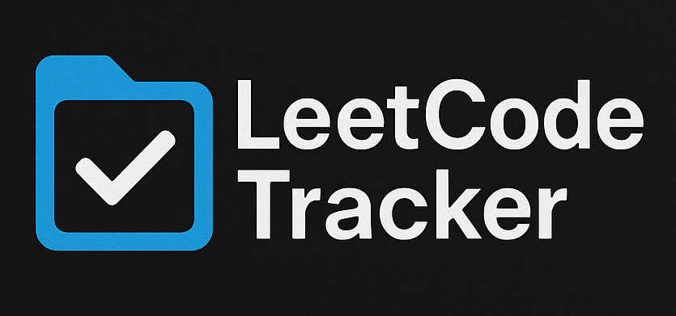
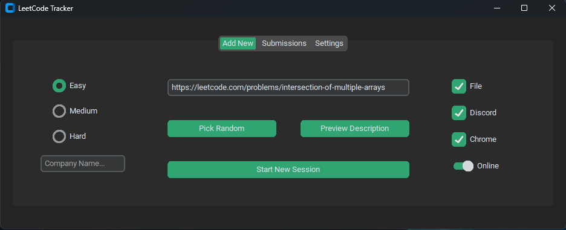

# 📊 LeetCode Tracker


A sleek, Python-based LeetCode companion built with [CustomTkinter](https://github.com/TomSchimansky/CustomTkinter), designed to boost your problem-solving with features like smart session management, company-specific filtering, Discord integration, and collaborative coding.

---

## ✨ Key Features

- **Smart Question Picker**
  - Paste a LeetCode link or auto-pick random problems.
  - Filter by difficulty or company (e.g., `Amazon`).
  - Auto-create `.py` file with starter code and start timer.

- **Live Collaboration**
  - Sync with others via a shared server—great for group sessions.

- **Submission Tracker**
  - Auto-scrapes your submissions (status, language, date).
  - Search and filter with a clean UI.

- **Toggleable Tools**
  - 🐍 **Auto File Generation** – Creates a coding file with default snippet.
  - 💬 **Post to Discord** – Sends code to a forum thread.
  - 🌐 **Open in Browser** – Launches the problem in Chrome.
  - 🔗 **Enable Sync Server** – Enables collaborative random picking.

- **Flexible Settings**
  - Set IDE path (VS Code / PyCharm)
  - Add LeetCode session token, Discord Forum ID, and server IP.

---

## 🛠️ Setup

### Requirements
- Python 3.9+
- `customtkinter`, `requests`, `bs4`, `discord.py`, etc.

```bash
pip install -r requirements.txt
```

### Get Started
```bash
git clone https://github.com/NoobPratik/leetcode-tracker.git
cd leetcode-tracker
```

- Configure your IDE path and LeetCode session in the **Settings** tab.
- (Optional) To use Discord sync:
  - Host a bot and provide its **Forum Channel ID**.
  - Run the server in `/discord`.

---

## 💡 Usage Flow

1. **Pick a Question**
   - Paste or auto-pick (filtered by difficulty/company).
2. **Start Session**
   - File + timer + code snippet appear.
3. **Solve & Submit**
   - View your submissions in the tracker tab.
4. **Share (Optional)**
   - Auto-post your solution to Discord.
5. **Collaborate**
   - Enable online mode to sync with friends.

---

## 🔐 Get Your LeetCode Session Token

1. Log in to [leetcode.com](https://leetcode.com)
2. Open Developer Tools (`F12`) → **Application** tab → **Cookies**
3. Copy value of `LEETCODE_SESSION` and paste it in Settings.

> ⚠️ **Keep your session token private.**

---

## 📷 Screenshots




---

## 👨‍💻 Author

Built with ❤️ by [Pratik2296](https://github.com/NoobPratik)

---

## 📄 License

MIT License • See [LICENSE](LICENSE)
